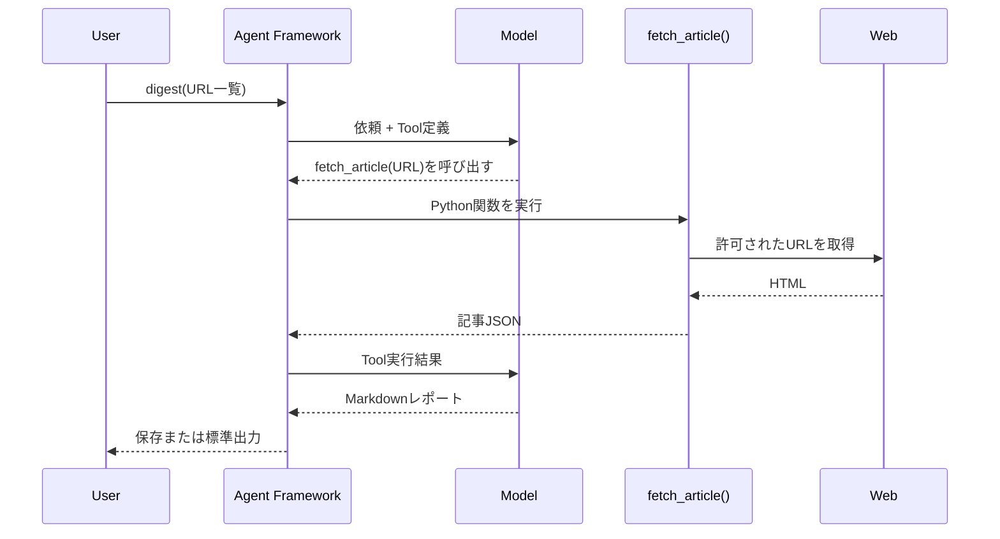

# Article Digest Agent

Microsoft Agent Framework の Function Tool がどのように呼び出されるかを、技術記事の取得と整理を題材に学ぶ Python CLI です。

`agent.run()` へ渡すのは依頼文と URL の一覧だけです。モデルが記事本文を必要と判断すると、Agent Framework がローカルの `fetch_article()` を実行し、その結果をモデルへ返します。



## このリポジトリで確認できること

- bound method を `tools=[tools.fetch_article]` で Function Tool として登録する
- Agent Framework がモデルとの Tool Calling ループを処理する
- Tool に状態を持たせ、ユーザー指定外の URL を拒否する
- 記事本文を信頼できないデータとして扱う
- LLMを使わない取得処理とAgent処理を分離してテストする
- OpenAIとMicrosoft Foundryのクライアントを切り替える

## 必要なもの

- Python 3.13以上
- [uv](https://docs.astral.sh/uv/)
- 次のいずれか
	- Microsoft Foundryプロジェクト、モデルデプロイ、Azure CLI
	- OpenAI APIキー

## セットアップ

```powershell
uv sync
Copy-Item .env.example .env
```

### Microsoft Foundry

Azure CLIでサインインします。

```powershell
az login
```

`.env`へプロジェクトエンドポイントと、Responses APIおよびFunction Callingに対応したモデルのデプロイ名を設定します。

```dotenv
ARTICLE_AGENT_PROVIDER=foundry
ARTICLE_AGENT_MODEL=your-model-deployment-name
FOUNDRY_PROJECT_ENDPOINT=https://your-project.services.ai.azure.com/api/projects/your-project
```

ローカル開発では`AzureCliCredential`が`az login`の資格情報を使います。APIキーは不要です。

### OpenAI

```dotenv
ARTICLE_AGENT_PROVIDER=openai
ARTICLE_AGENT_MODEL=gpt-4.1-mini
OPENAI_API_KEY=your-api-key
```

## 実行

### LLMを使わず記事を抽出する

```powershell
uv run article-digest-agent fetch https://github.com/microsoft/agent-framework
```

### 複数記事を整理する

```powershell
$urls = @(
	"https://github.com/microsoft/semantic-kernel"
	"https://github.com/microsoft/agent-framework"
)

uv run article-digest-agent digest @urls --output reports/digest.md
```

`reports/digest.md`へ、記事ごとの要約、共通点、相違点、読む順番が出力されます。生成結果はモデルと実行時点によって変わります。

## Tool Callingの中心部分

```python
tools = ArticleTools(urls, self._fetcher)
agent = self._chat_client.as_agent(
		name="ArticleDigestAgent",
		instructions=AGENT_INSTRUCTIONS,
		tools=[tools.fetch_article],
)

response = await agent.run(
		"以下の記事を取得して比較してください。\n\n"
		+ "\n".join(f"- {url}" for url in urls)
)
```

`run()`へ記事本文を直接渡しているわけではありません。モデルが返したTool呼び出しをAgent Frameworkが受け取り、登録済みのPython関数を実行します。

`fetch_article`は`ArticleTools`インスタンスに束縛されたメソッドです。そのため、インスタンスが保持している許可URLとFetcherを利用できます。

```python
if url not in self._allowed_urls:
		raise ValueError("The requested URL was not supplied by the user")
```

## 安全性のために入れている基本防御

- `http`と`https`以外を拒否
- URL内のユーザー名とパスワードを拒否
- localhostと非公開IPアドレスを拒否
- リダイレクト先をもう一度検査
- ダウンロードサイズ、本文文字数、リダイレクト回数を制限
- Agentがユーザー指定外のURLをToolへ渡しても拒否
- 記事本文内の命令へ従わないようAgentへ指示

この実装は学習用です。DNS rebindingなど、接続時の再解決を含む高度なSSRF対策を完全には扱っていません。公開サービスへ組み込む場合は、ネットワークレベルの送信先制御、プロキシ、監査、タイムアウト、レート制限などを別途設計してください。

## 開発

```powershell
uv run pytest -q
uv run ruff check .
```

テストでは実際のモデルを呼び出しません。Fake AgentとHTTPモックを使い、Tool登録、指定外URLの拒否、本文抽出を検証します。

## 制限

- JavaScriptで描画される本文は取得できない場合があります
- 公開日や著者をページから抽出できない場合があります
- 出力内容はモデルに依存するため、事実確認が必要です
- Web全体から最新情報を検索する機能や、過去レポートの長期記憶はありません

## License

[MIT License](LICENSE)
